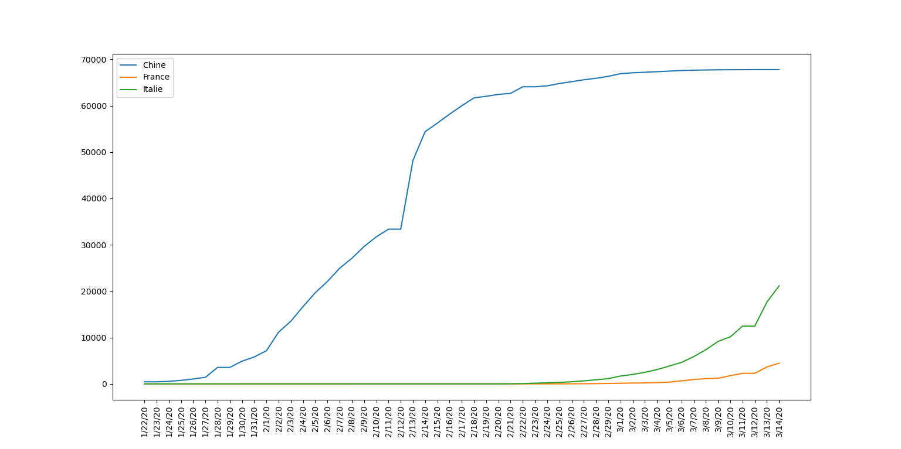
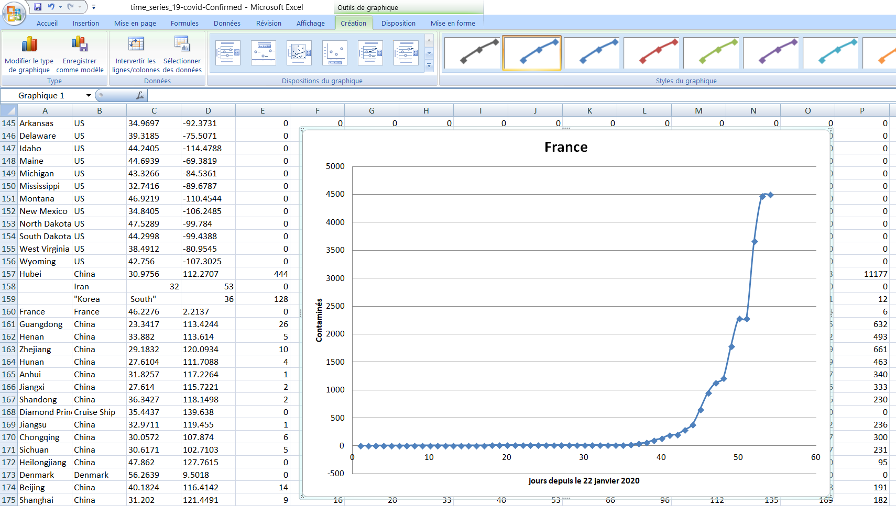

# Covid-19 : Accès aux données

A l’heure des "fake news", ces fausses informations qui se répandent rapidement, il est important de vérifier en permanence l’exactitude des dépêches que nous recevons depuis divers supports, ce qui est loin d’être simple !

Les chercheurs de l’université Johns Hopkins ont dans ce but produit une carte qui permet de suivre et de visualiser les rapports sur l’épidémie en utilisant les données des Centres américains et chinois de contrôle et de prévention des maladies, de l’Organisation mondiale de la santé et d’autres sources. Au fur et à mesure de l’arrivée des rapports, la carte est actualisée avec le nombre total de cas confirmés, ainsi que ceux des décès et des guérisons. Chaque point rouge représente un foyer d’apparition de la maladie, dont la taille correspond à l’ampleur relative de contagion. En cliquant sur l’un d’entre eux, on obtient les informations relatives à la région.

Accès au site de l'université Johns Hopkins : https://systems.jhu.edu/

Accès aux données brutes sur leur espace github : https://github.com/CSSEGISandData/COVID-19

## Objectif

Notre objectif est développer une application Python pour :

* récupérer les données brutes de la propagation du virus au format **csv**,
* les transformer au format **json**
* les filtrer par pays,
* Tracer un graphic de l'évolution de la propagation

## Téléchargement du fichier csv

* `covid_19v1.py`

## Lecture du fichier csv

* `covid_19v2.py`

## Filtrage des données pour un pays

* `covid_19v3.py`

## tracer les courbes d'évolution de la contamination

On tracera les courbes de l'évolution de la contamination pour la Chine (Hubei), l'Italie et la France

* `covid_19v4.py`

